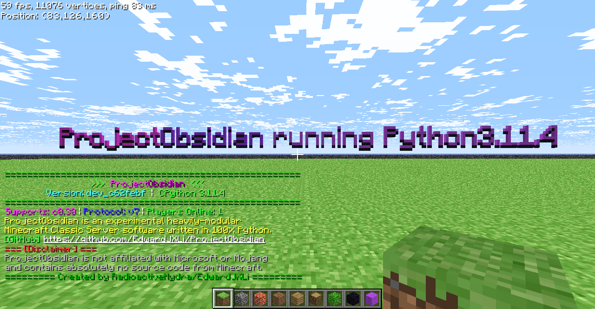

# ⚠️ ProjectObsidian Experimental Netcode Branch ⚠️

This is a fork of ProjectObsidian that aims to improve the netcode of the server. It is currently in a very early stage of development and is not recommended for use in production environments. This is essentially a playground for new ideas and concepts that may or may not be merged into the main branch.




# Features
- Full Implementation of the Minecraft Classic Protocol
- Asynchronous & Multithreaded
- Supports [CPE (Classic Protocol Extension)](https://wiki.vg/Classic_Protocol_Extension)
- Highly Customizable and Modular
- Multi-World Support
- Supports Multiple World Formats
- [Fully featured plugin support](obsidian/modules/README.md)

# Installation Instructions
> Obsidian Server requires **no 3rd party libraries**, meaning that you can run this server with a stock Python installation!

On linux, install `python3.10` and clone the repository.
```
apt-get install python3.10
git clone https://github.com/RadioactiveHydra/ProjectObsidian.git
```

> (!) Minimum of **python 3.10** is required! (!)

Then, just navigate into the directory and run `main.py`!
```
cd ProjectObsidian
python3.10 main.py
```

Once you have the server up, you can run `main.py -h` to see the available flags you can set

# Plugins
Project Obsidian comes with numerous plugins to get you started. Check them out here: [Plugins](obsidian/modules/README.md)

# Plugin Development
For information regarding plugin development, refer to the [Plugin Development Guide](DEVELOPMENT.md) (Coming Soon).

# Getting Help
If you have any issues, feel free to join our discord server!
[https://discord.hydranet.dev/](https://discord.hydranet.dev/)

# Disclaimers
**Project Obsidian is not affiliated with (or supported by) Mojang AB, Minecraft, or Microsoft in any way.**
